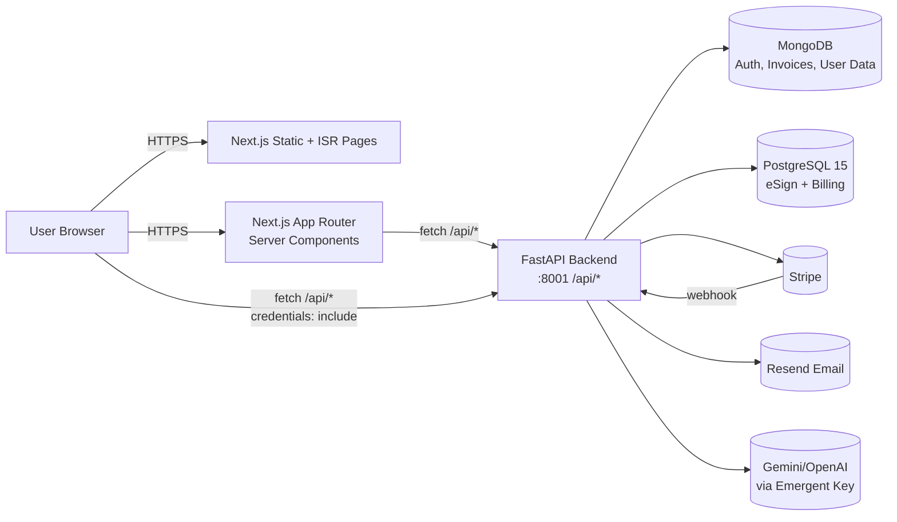

# 01 — Project Overview

## Project Name

**RealProfits** — a financial + career decision platform with embedded
productive tools (Invoice Generator, eSign).

## Purpose & Business Goals

RealProfits gives American workers and freelancers fast, free decision tools
plus deep, SEO-discoverable content on salary, taxes, mortgages, debt, and
career. Two strategic pillars:

1. **Programmatic SEO (pSEO)** — ~2,400+ pre-rendered pages (salary leaves,
   invoice templates, contract templates, learn guides) drive organic
   acquisition.
2. **Productive Tools** — Invoice Generator and the **RealProfits eSign**
   tool (DocuSign competitor with free tier + paid Pro/Business via Stripe).
   These are the monetisation handles.

## High-Level Architecture

## Technology Stack

| Layer            | Tech                                                                                   |
|------------------|----------------------------------------------------------------------------------------|
| Frontend         | Next.js **16.2** (App Router), React 19, TypeScript, Tailwind CSS v4, shadcn/ui        |
| State / forms    | React Hook Form, Zod, React Query                                                      |
| PDF / canvas     | `pdfjs-dist` (self-hosted worker), `jspdf`, `qrcode`, `react-signature-canvas`         |
| Charts / motion  | Recharts, Framer Motion                                                                |
| Backend          | Python 3.11, FastAPI, Uvicorn, Pydantic v2                                             |
| Auth             | JWT (HS256), bcrypt, HttpOnly cookies, brute-force lockouts                            |
| Document DB      | MongoDB 7 via `motor` (async)                                                          |
| Relational DB    | PostgreSQL 15 via `asyncpg` + SQLAlchemy 2.0 async                                     |
| Background jobs  | APScheduler (in-process)                                                               |
| AI               | `emergentintegrations` — Gemini, GPT-4o-mini via Emergent LLM Key                      |
| Payments         | Stripe Checkout, Billing Portal, Webhooks                                              |
| Email            | Resend HTTP API                                                                        |
| Process mgr      | Supervisor (dev pod) / PM2 (production)                                                |
| Reverse proxy    | Kubernetes ingress (pod) / Nginx (production)                                          |
| Build            | Yarn 1.22, `next build`, post-build IndexNow ping script                               |

## Third-Party Integrations

| Provider                | Used for                                        | Auth                                  | Code                                            |
|-------------------------|-------------------------------------------------|---------------------------------------|-------------------------------------------------|
| **Resend**              | Transactional email (signature requests, etc.)  | `RESEND_API_KEY` env                  | `backend/esign/email_service.py`, `invoices.py` |
| **Stripe**              | Subscription billing for Pro / Business tiers   | `STRIPE_API_KEY`, `STRIPE_WEBHOOK_SECRET` | `backend/billing/`                          |
| **Emergent LLM Key**    | Universal key for Gemini + OpenAI               | `EMERGENT_LLM_KEY` env                | `backend/server.py` (career-tools, tax-tools)   |
| **IndexNow**            | Search engine ping after each deploy            | static key file                       | `frontend/scripts/post-build-ping.ts`           |
| **Google Search Console** | Manual sitemap submission                     | manual                                | n/a                                             |

## External Services Used

- **MongoDB** instance (local pod: `mongodb://localhost:27017`; production: managed).
- **PostgreSQL 15** instance (`realprofits_esign` database).
- **Resend** account with verified sending domain.
- **Stripe** account in test or live mode.
- **Emergent LLM proxy** (`integrations.emergentagent.com`).

## What Lives Where (Domain Model)

| Concept                       | Storage    | File                                                |
|-------------------------------|------------|-----------------------------------------------------|
| Users, sessions, password reset | MongoDB  | `backend/auth.py`, `backend/db.py`                  |
| Invoices + clients            | MongoDB    | `backend/invoices.py`                               |
| Calculator caches / resume drafts / user_data | MongoDB | `backend/user_data.py`, `backend/server.py` |
| Analytics events              | MongoDB    | `backend/analytics.py`                              |
| eSign documents / signers / fields / audit | PostgreSQL | `backend/esign/`                          |
| Stripe subscriptions          | PostgreSQL | `backend/billing/`                                  |
| Resume PDFs, invoice logos    | Filesystem `backend/uploads/` |                                  |
| Signed PDFs                   | Filesystem `backend/uploads/esign/`                                |
