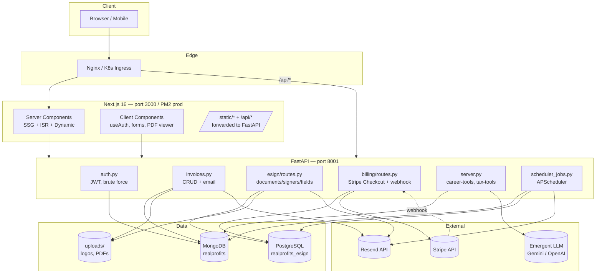
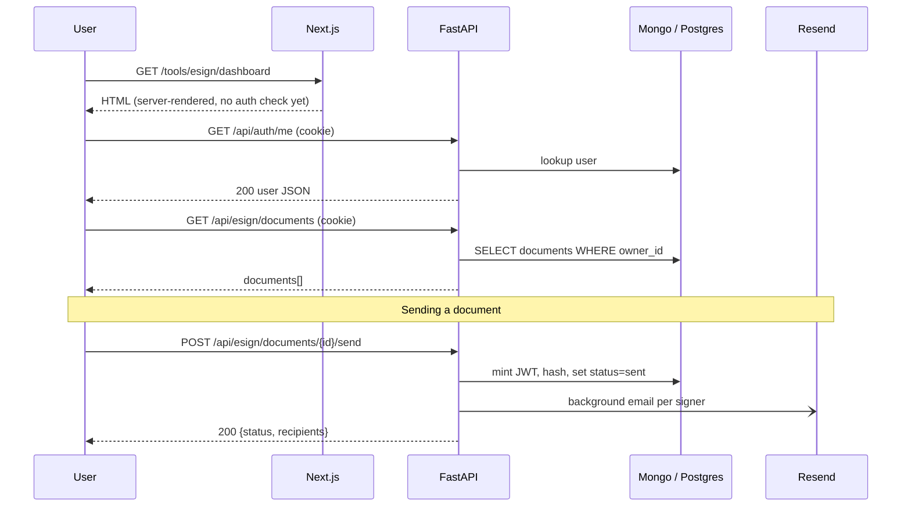
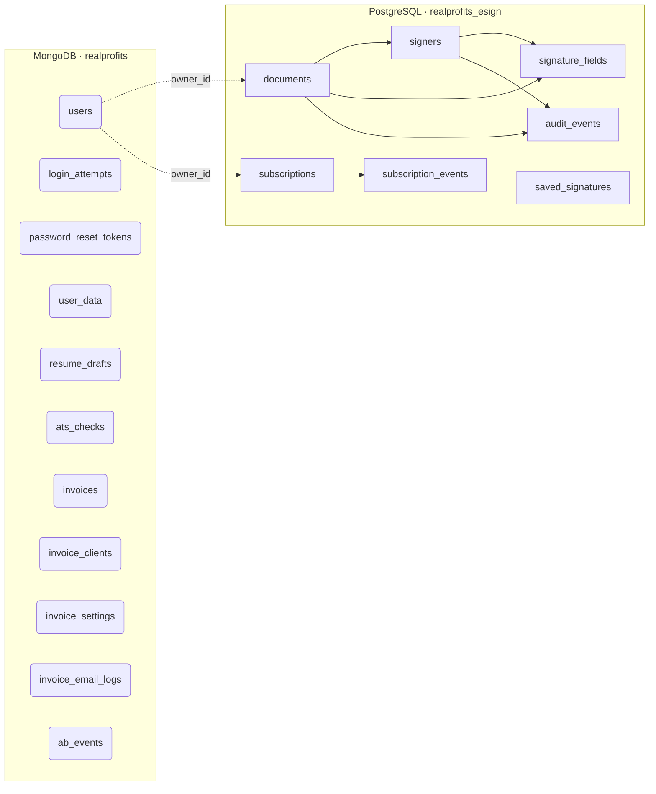
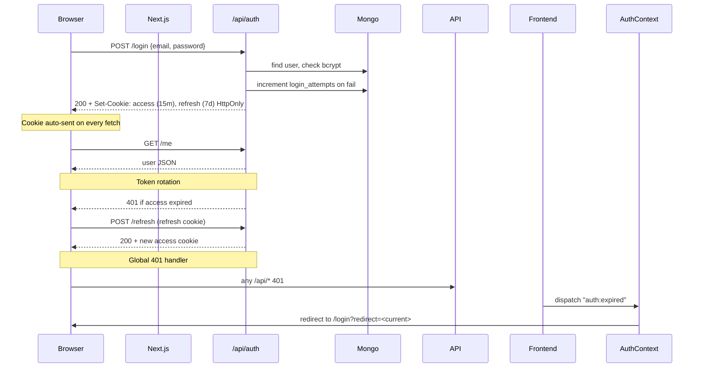

# 02 — System Architecture

## 2.1 Application Architecture



## 2.2 Request Flow



## 2.3 Frontend Architecture

```
frontend/
├── app/                        # Next.js App Router (pages = directories)
│   ├── layout.tsx              # Root layout: Navbar, Footer, AuthProvider
│   ├── globals.css             # Tailwind v4 + CSS variables
│   ├── login/                  # /login page (renders LoginForm client component)
│   ├── tools/
│   │   ├── invoice/page.tsx    # Mounts InvoiceApp
│   │   ├── esign/
│   │   │   ├── page.tsx        # Landing
│   │   │   ├── dashboard/page.tsx
│   │   │   ├── new/page.tsx    # Wizard
│   │   │   └── edit/[id]/page.tsx
│   ├── sign/[token]/page.tsx   # Public signing
│   ├── verify/[docId]/page.tsx # Public verification
│   ├── i/[token]/page.tsx      # Public invoice portal
│   ├── salary/, /learn/, /guides/, /invoice-template/, /contract-template/
│   │                            # SSG pSEO routes via generateStaticParams
│   └── sitemap*.xml/route.ts   # Dynamic sitemaps
├── src/
│   ├── contexts/AuthContext.tsx # Global auth state + 401 redirect
│   ├── components/
│   │   ├── ui/                  # shadcn/ui primitives
│   │   ├── esign/               # EsignDashboard, EsignWizard, SigningPage, ...
│   │   ├── invoice-app/         # InvoiceApp, Editor, Preview, ...
│   │   ├── resume/              # Resume builder
│   │   ├── billing/             # PricingPage, BillingPage
│   │   ├── career-tools/        # 10+ calculators
│   │   └── tax-tools/
│   ├── data/pseo/               # Cities, jobs, professions, industries datasets
│   ├── lib/                     # pdf-brand.ts, sitemap-data.ts, storage.ts, ...
│   └── hooks/                   # use-toast, useTaxAI, etc.
└── public/pdfjs/pdf.worker.min.mjs # self-hosted PDF.js worker
```

### Rendering Strategy

| Route family               | Mode                  | Notes                                    |
|----------------------------|-----------------------|------------------------------------------|
| `/`, `/learn/*`, `/salary/*`, `/invoice-template/*`, `/contract-template/*`, `/guides/*` | SSG (`generateStaticParams`) | Built once, served by Next |
| `/tools/*`, `/account/*`, `/login`, `/register` | Client components, no SSG | Hydrated, rely on REST APIs |
| `/sign/[token]`, `/verify/[docId]`, `/i/[token]` | Dynamic (server-rendered) | Token in URL; no auth needed |
| `/sitemap*.xml`            | Static Route Handler  | Generated at build              |

## 2.4 Backend Architecture

```
backend/
├── server.py            # FastAPI app, mounts routers, AI tool endpoints
├── auth.py              # /api/auth/*    (JWT cookies, brute force)
├── invoices.py          # /api/invoices/* (Mongo)
├── user_data.py         # /api/user-data/* (per-tool localStorage→Mongo sync)
├── analytics.py         # /api/analytics/* (A/B events)
├── db.py                # Mongo client + indices on startup
├── scheduler_jobs.py    # APScheduler reminders + reset jobs
├── esign/
│   ├── database.py      # SQLAlchemy async engine + SessionLocal
│   ├── models.py        # Document, Signer, SignatureField, AuditEvent
│   ├── schemas.py       # Pydantic in/out models
│   ├── routes.py        # /api/esign/*
│   ├── email_service.py # Role-aware Resend emails
│   ├── pdf_processor.py # PDF parsing, overlay, audit page
│   ├── tokens.py        # Signing JWT mint/decode + SHA256 hash
│   └── storage.py       # Filesystem PDF persistence
├── billing/
│   ├── routes.py        # /api/billing/*
│   ├── service.py       # Stripe Checkout/Portal/Webhook handlers
│   ├── tiers.py         # TIER_LIMITS, assert_can_*
│   ├── models.py        # Subscription, SubscriptionEvent, SavedSignature
│   └── saved_signature.py # /api/esign/signature CRUD (per-user)
└── uploads/             # logos, eSign PDFs (gitignored)
```

### Router Mounting (`server.py`)

```python
app.include_router(auth_router)         # /api/auth
app.include_router(user_data_router)    # /api/user-data
app.include_router(invoices_router)     # /api/invoices
app.include_router(esign_router)        # /api/esign
app.include_router(billing_router)      # /api/billing
app.include_router(saved_sig_router)    # /api/esign/signature
app.include_router(analytics_router)    # /api/analytics
```

### Startup / Shutdown

- `@app.on_event("startup")` — creates Mongo indices (`db.create_indexes`), creates Postgres tables if missing, starts APScheduler.
- `@app.on_event("shutdown")` — closes Mongo + Postgres pools, shuts the scheduler.

## 2.5 Database Architecture



See **[04 Database](./04-database.md)** for full schemas and ER diagram.

## 2.6 Authentication Flow



Full detail in **[07 Auth](./07-auth.md)**.

## 2.7 API Flow Reference

| Surface                | Path prefix          | Auth?          |
|------------------------|----------------------|----------------|
| Health / Diagnostics   | `/api/health`, `/api/admin/email-diag` | No (admin email-diag uses bearer) |
| Auth                   | `/api/auth/*`        | Cookie         |
| User Data              | `/api/user-data/*`   | Cookie         |
| Invoices               | `/api/invoices/*`    | Cookie         |
| Invoice public portal  | `/api/invoices/public/{token}` | No (token) |
| Career Tools           | `/api/career-tools/*` | No (rate-limited via cache hash) |
| Tax Tools              | `/api/tax-tools/*`   | No             |
| eSign (owner)          | `/api/esign/documents/*` | Cookie     |
| eSign (signer)         | `/api/esign/sign/{token}` | Token only |
| eSign verify           | `/api/esign/verify/{doc_id}` | Public  |
| Billing                | `/api/billing/*`     | Cookie (webhook is signed) |
| Analytics              | `/api/analytics/*`   | Cookie (admin for summary) |
| Sitemap                | `/api/sitemap.xml`   | No             |

Full per-endpoint reference in **[06 API](./06-api.md)**.
